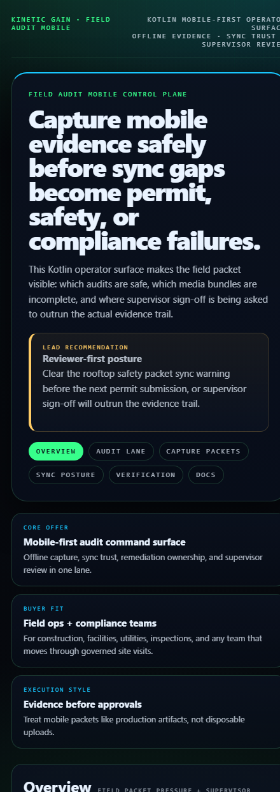
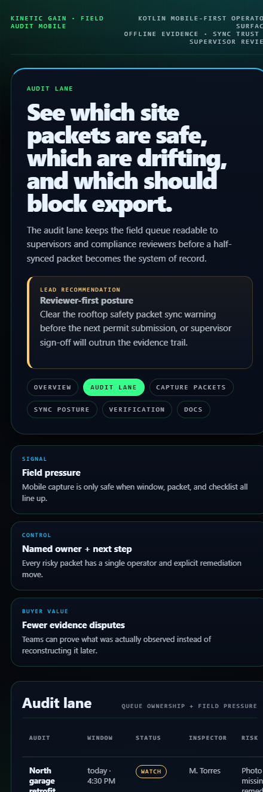
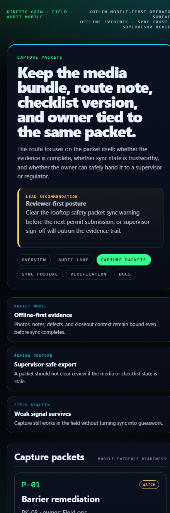
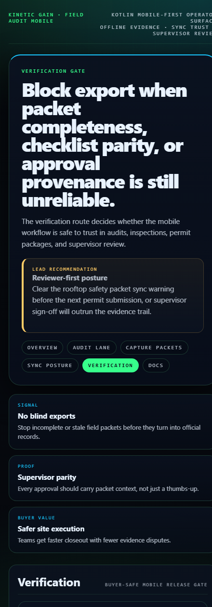

# Field Audit Mobile

Kotlin mobile-first field audit control plane for offline evidence capture, supervisor escalation, permit-safe remediation, and sync-trust visibility.

## Why this exists

- Field teams lose trust fast when audits are captured in one app, remediation notes live in chat, and supervisor sign-off happens in disconnected spreadsheets.
- Construction, utilities, facility ops, and regulated field teams need to know whether evidence is complete before work continues or a package is submitted.
- Mobile workflows need offline-safe capture, sync confidence, and buyer-readable escalation logic, not just a form screen.

## Why this matters (KG Embedded tie-back)

This repo demonstrates the field-audit primitive for Kinetic Gain Embedded: mobile-first evidence capture, sync posture, remediation state, and supervisor approval exposed through one operator surface. In a production SaaS product, the same pattern can sit inside inspections, compliance walks, property checks, utility service visits, or safety rounds without forcing operators to choose between offline usability and governed evidence.

## Routes

- `/`
- `/audit-lane`
- `/capture-packets`
- `/sync-posture`
- `/verification`
- `/docs`

## API

- `/api/dashboard/summary`
- `/api/audit-lane`
- `/api/capture-packets`
- `/api/sync-posture`
- `/api/verification`
- `/api/sample`

## Screenshots






## Local development

```powershell
cd field-audit-mobile
.\gradlew.bat run --args=server
```

Open:
- [http://127.0.0.1:5572/](http://127.0.0.1:5572/)
- [http://127.0.0.1:5572/audit-lane](http://127.0.0.1:5572/audit-lane)
- [http://127.0.0.1:5572/capture-packets](http://127.0.0.1:5572/capture-packets)
- [http://127.0.0.1:5572/sync-posture](http://127.0.0.1:5572/sync-posture)

## Validation

- `.\gradlew.bat test`
- `.\gradlew.bat run --args=demo`
- `.\gradlew.bat run --args=prerender`
- `.\gradlew.bat run --args=smoke`
- `powershell -ExecutionPolicy Bypass -File .\scripts\render_readme_assets.ps1`

## Production status

| Aspect | Status |
|--------|--------|
| Language | Kotlin / JVM 21 |
| License | [AGPL-3.0-or-later](./LICENSE) |
| Security | [SECURITY.md](./SECURITY.md) |
| Deploy | Static prerender -> **https://field.kineticgain.com/** |

## Docs

- [Architecture](./docs/architecture.md)
- [Origin](./docs/ORIGIN.md)
- [Kinetic Gain Embedded tie-back](./docs/KINETIC_GAIN_EMBEDDED.md)
- [Changelog](./CHANGELOG.md)
